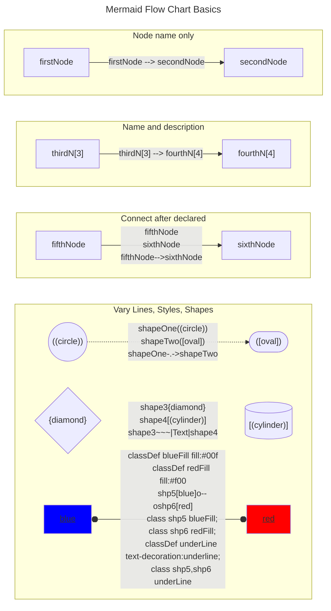

## Project Management [Flow Charts using Mermaid](https://mermaid.js.org/syntax/flowchart.html)

```mermaid
---
title: Mermaid Flow Chart Basics
---
flowchart TD
    subgraph un[Node name only]
        direction LR
        firstNode--"firstNode --> secondNode"-->secondNode
    end

    subgraph doux[Name and description]
        direction LR
        thirdN["thirdN[3]"]--"thirdN[3] --> fourthN[4]"-->fourthN["fourthN[4]"]
    end

    subgraph troix[Connect after declared]
        direction LR
        fifthNode
        sixthNode
        fifthNode--"""
            fifthNode
            sixthNode
            fifthNode-->sixthNode
        """-->sixthNode
    end

    subgraph quatre[Vary Lines, Styles, Shapes]
        direction LR
        shapeOne(("((circle))"))
        shapeTwo(["([oval])"])
        shapeOne-."""
        shapeOne((circle))
        shapeTwo([oval])
        shapeOne-.->shapeTwo
        """-.->shapeTwo

        shape3{"{diamond}"}
        shape4[("[(cylinder)]")]
        shape3~~~|"
        shape3{diamond}
        shape4[(cylinder)]
        shape3~~~|Text|shape4
        "|shape4

        classDef blueFill fill:#00f;
        classDef redFill fill:#f00;
        shp5[blue]o--o|"""
        classDef blueFill fill:#00f;
        classDef redFill fill:#f00;
        shp5[blue]o--oshp6[red]
        class shp5 blueFill;
        class shp6 redFill;
        classDef underLine text-decoration:underline;
        class shp5,shp6 underLine
        """|shp6[red]
        class shp5 blueFill;
        class shp6 redFill;
        classDef underLine text-decoration:underline;
        class shp5,shp6 underLine

        

    end

    un~~~doux~~~troix~~~quatre


```