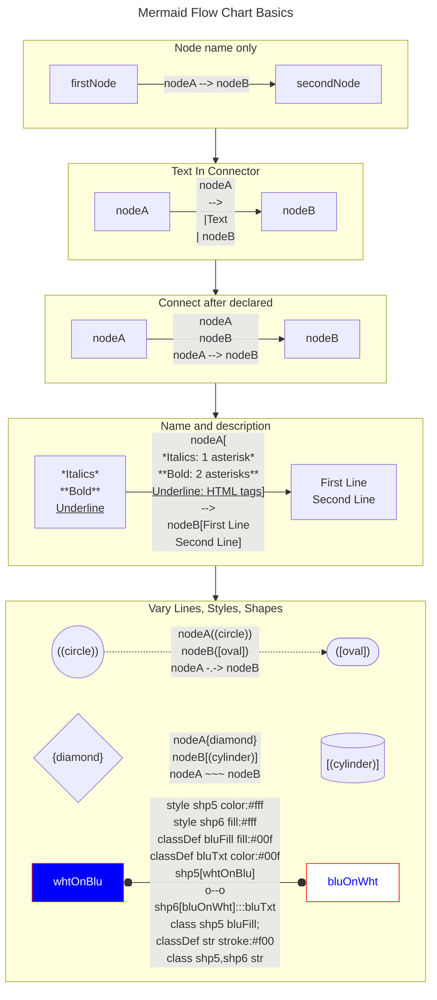

## Project Management Flow Charts using Mermaid

### Mermaid Markdown, Visualization via JavaScript
> Source: [Mermaid.JS.Org](https://mermaid.js.org/syntax/flowchart.html)  

### Project Management Flow Charts, Visualizing Workflows  

+ Process Mapping
  + Breakin' Some Eggs
    * Understand before and during optimization. Don't remove what's working unless there's something better readily applicable. Notes can be referred to when the process is better understood -- some may remain useful ideas, others might need deprecation based on knowledge gained.
  + Generic Icon Shapes, Color Schemes, and Connectors
  + Entity Definition
    * Not the noun, the process of defining what acts or is acted upon through an activity 
        `TODO: [Archives of Nethys](https://2e.aonprd.com/Activities.aspx),`
  + Branch Definition
    * More than a boolean
  + Region definition
    * How to group processes
      - Don't only give results, empower current and future instances of an activity

+ Both Feet First
  + Time Management -- and Task Management
    * MVP as Self-Management
      - Perfectionism paradigm, and the Pareto Principle
      - Time and effort as resources to be managed
    * MVC and Other Frameworks
      - "Jig"
      - 
      